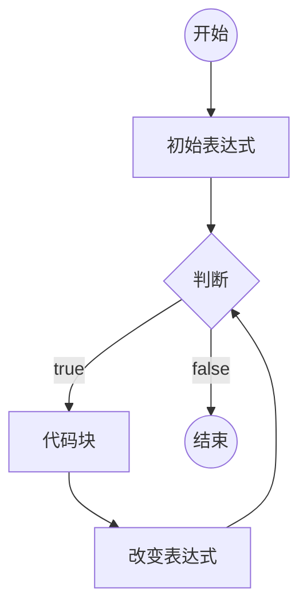
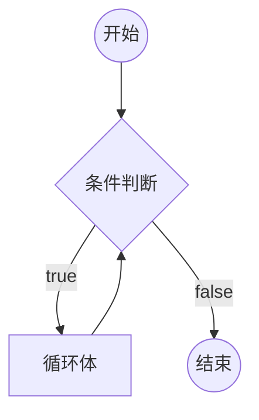
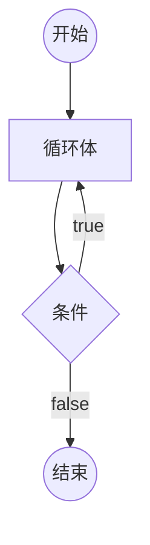

## for循环原理

```mermaid
graph TD
开始((开始))-->表达式[初始表达式]-->if{判断}
if{判断}--true-->循环体[代码块]-->改变表达式[改变表达式]-->if
if{判断}--false-->结束((结束))
```

## while循环原理

```mermaid
graph TD
kaishi((开始))-->if{条件判断}--true-->xhuanti[循环体]-->if--false-->jies((结束))
```

## do-while循环

```mermaid
graph TD
kaishi((开始))-->xhuanti[循环体]-->if{条件}--true-->xhuanti[循环体]
if--false-->jies((结束))
```
