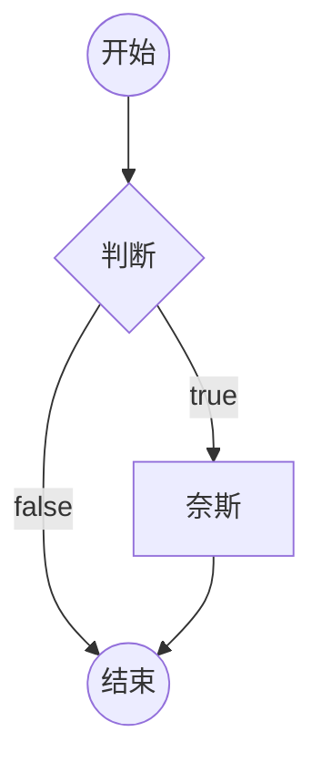
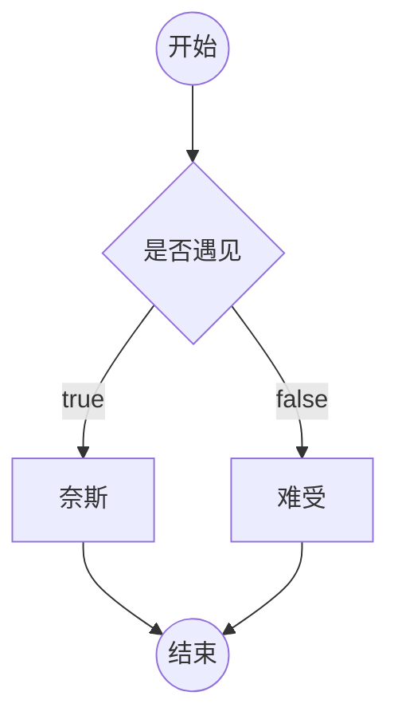
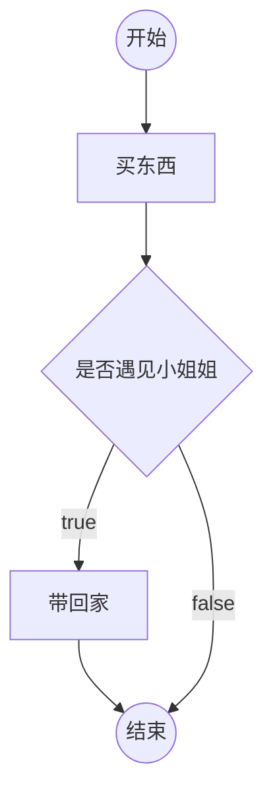

# 流程图

一套的标椎的图形,用于描述程序的逻辑

通常流程图分析程序的流程

## 在 markdown 中画流程图

圆形表示开始或结束

菱形表示判断

方形表示步骤

箭头表示指向

```mermaid
graph TD
start((开始)) -->if{判断}
if--true-->A[奈斯]
if--false-->ed((结束))
A-->ed
```

## 例子

```mermaid
graph TD
开始((开始))-->判断{是否遇见}
判断--true-->内容[奈斯]-->结束((结束))
判断--false-->内容2[难受]-->结束((结束))

```

## 例子2

```mermaid
graph TD
kaishi((开始))-->mai[买东西]
mai-->if{是否遇见小姐姐}
if--true-->huijia[带回家]-->结束((结束))
if--false-->结束((结束))
```
