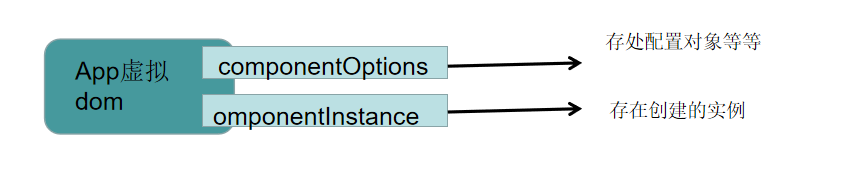
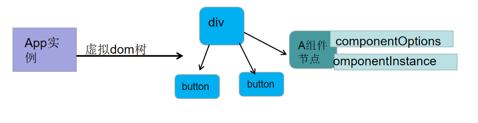

# Vue 生命周期


### 创建Vue实例
      创建vue实例和创建组件的流程基本一致。
  
1.首先做一些初始化的操作，主要是数组一些私有属性到实例中。
如：
```js
    //  伪代码
  function Vue(options){
      this.$xx = xxx;
      this._xx = xxx;
  };

```
  主要设置一些以 `$开头` 和 `_开头` 的属性到实例中等等。
  
  该初始化骚操作后，会运行生命周期钩子 **beforeCreate**

2.进入注入流程: 
   处理 `属性、computed、methods、data、provide、inject`,最后使用代理模式将其挂载到实例中。
   如：
```js
    //伪代码

    function Vue(options){
        ......骚操作设置私有属性
        运行 beforeCreate钩子

        进入注入流程： 
          const data = typeof(options.data) === 'function' ? options.data() : options.data;
          Observer(data); //将数据变成响应式
          //属性、computed 同样是 Observer操作等

          //代理  属性、computed 同样也是这样的骚操作
          for(let key in data){
              Object.defineProperty(this,key,{
                  get(){
                      return data.key;
                  },
                  set(val){
                      return data.key = val;
                  }
              })
          };

          const mets = options.methods;
          for(let key in mets){
              this.key = mets.bind(this); //将函数的this,变成实例
          };
    }
```
   注入的骚操作完成后，运行 **created**钩子函数。

3.获取 render函数 
   如果有配置 `render函数`,直接使用配置的 `render函数`,如果没有，那么将使用运行时编译器，把模板编译成 `render函数`。
   获取到 `render函数`，运行生命期钩子函数 **beforeMount**

7.进入渲染流程：
   创建一个 `Watcher`，传入一个函数 `updateComponent`,该函数会运行 `render函数`，把得到的 `vnode`(也就是虚拟dom树)，再传入给 `_update函数`执行。
   如:
   ```js
      const updateComponent = ()=>{
          this._update(this._render());
      };

      new Watcher(updateComponent);  //Watcher的功能是对依赖进行观察
   ```
   在执行 `render函数`的过程中，会收集所有依赖，将来依赖变化时会重新运行 `updateComponent函数`(交给`Watcher函数`来执行)。
   在执行 `_update函数`的过程中，触发 `patch函数`,由于目前没有旧树，因此直接为当前的虚拟dom树的每一个普通节点生成 eml属性，`即为真实dom`。
   如果遇到创建一个组件的`vnode`(虚拟dom树)，则会进入组件实例化流程，该流程和创建`vue实例`流程基本相同，最终会把创建好的组件实例挂载到`vnode`的 `componentInstance`属性中，以便复用。
   例子：
   ```js
    const vm = new Vue({
          render(h){
             return h(App)
          }
      });
//==========================   
    //App组件的结构
    /* 
        模板部分
        <div id="app">
           <A v-if="show" :count="count" :key="count" />
           <button @click="count++">increase</button>
           <button @click="show=!show">toggle</button>
        <div>    
    */
   //配置对象部分
   const App = {
       components:{A},
       data(){
           return { 
               show:true,
               count:0
           }
       }
   };
  //======================
   //A组件的结构
   /* 
       模板部分
       <div>
          <h1>A compnent:{{ count }}</h1>
          <B :count="count" />
       </div>
   */
  //配置对象部分
  const A = {
      components:{B},
      props:['count']
  };

//========================
  //B组件的结构
  /* 
     模板部分
     <div>
       <h1>B compnent:{{ count }}</h1>
     </div>
  */
 //配置对象部分
 const B = {
     props:['count']
 }

   ```
 如果是第一次渲染：
   创建 `vm实例`, 初始化--->执行**beforeCreate**钩子-->注入--->执行**created**钩子--->获取`render函数`--->执行**beforeMount**钩子--->进入渲染流程：
   创建一个 App组件虚拟节点(可以看做:`<App></App>`,但是是虚拟节点)，因为是可以为组件传递属性和事件，因此组件虚拟节点拥有`componentOptions`属性，该属性是存父组件传递过来的属性、事件等等。
</img>


   `patch函数`进行`diff`对比,没有旧的对应的组件虚拟节点，那么会创建该组件实例 `new Vue(App.componentOptions.组件的配置对象)` ，然后同样 初始化等等一些列骚操作。进入渲染流程 创建虚拟节点。`是一个递归的过程`
</img>

以此类推，直到渲染完成，然后从子孙组件到祖先组件依次运行 **mounted钩子**


### 重渲染
   1.数据变化后，所有依赖该数据的 `Watcher` 均会重新运行，这里仅考虑`updateComponent`函数对应的`Watcher`。
   
   2.`Wacher` 会被调度器放到 `nextTick`中运行，也就是**微队列**中,这样是为了避免多个依赖的数据同时改变后被多次执行。

   3.运行生命周期钩子函数 **beforeUpdate**。

   4. **updateComponent**函数重新执行
          在执行 `render函数`时，会先去除掉之前的`watcher`依赖，重新收集所有依赖，将来依赖变化时重新运行 
          `updateComponent函数`。
如：
```js
    //....重新执行
    function (){
        new Watcher(对应依赖`wacher`里的`updateComponent函数`)
    }();
```
 
   在执行 `_update`函数的过程中，触发`patch函数`。
   新旧两课树进行对比。
   普通`html节点`的对比会导致真实节点被 更新、移动、删除、创建。
   组件节点的对比会导致组件被 更新、移动、删除、创建。
   当新组件需要创建时，进入`实例化流程`。
   当旧组件需要删除时，会调用旧组件的 `$destroy`方法 删除组件，该方法会先触发生命周期钩子函数 **beforeDestroy**,然后递归调用子组件的 `$destroy`方法，然后触发生命周期钩子函数 **destroyed**。

   5.运行生命周期钩子函数 **updated**。


在Vue中，父组件的beforeDestroy函数会先于子组件的beforeDestroy函数执行。

当一个Vue组件被销毁时，Vue会按照组件树的顺序依次销毁子组件，然后销毁父组件。在销毁过程中，Vue会先触发父组件的beforeDestroy钩子函数，然后再依次触发子组件的beforeDestroy钩子函数。